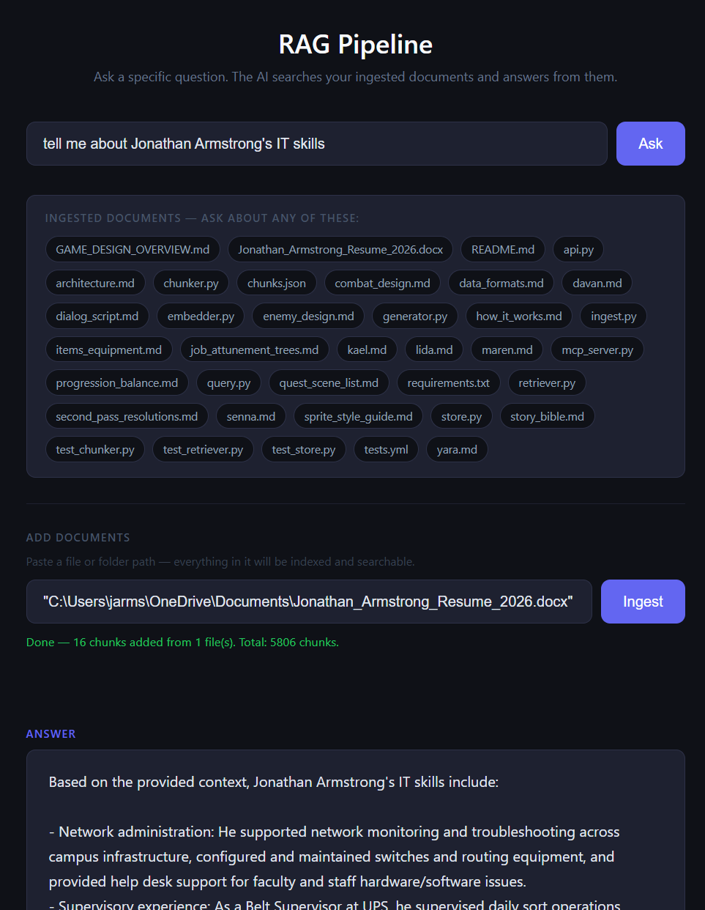

# RAG Pipeline

A fully local Retrieval-Augmented Generation (RAG) system. Ingest your documents, ask questions, get answers grounded in your own content — no API keys, no cloud, no ongoing cost.

Built on [llama-cpp-python](https://github.com/abetlen/llama-cpp-python) with GGUF models from HuggingFace. Ships with a web UI and an MCP server for Claude Desktop.



---

## How It Works

1. **Ingest** — point it at a file or folder. The chunker splits everything into overlapping ~500-character chunks.
2. **Embed** — each chunk is converted to a vector using `nomic-embed-text` running locally.
3. **Store** — vectors are saved to disk as `data/vectors.npy`. Chunks are saved to `data/chunks.json`.
4. **Query** — your question is embedded, cosine similarity finds the most relevant chunks, and `Llama 3.2 3B Instruct` generates an answer using only those chunks as context.

Everything runs on your machine. Nothing leaves your computer.

---

## Requirements

- Python 3.12
- No C++ compiler needed — uses pre-built wheels

### Install dependencies

```bash
pip install fastapi uvicorn python-docx
```

### Install llama-cpp-python (pre-built wheel, no compiler required)

```bash
pip install https://github.com/abetlen/llama-cpp-python/releases/download/v0.3.19/llama_cpp_python-0.3.19-cp312-cp312-win_amd64.whl
```

> For other platforms, find the matching wheel at [llama-cpp-python releases](https://github.com/abetlen/llama-cpp-python/releases).

---

## Models

Download these GGUF files from HuggingFace and place them anywhere on your machine. Update the paths in `core/generator.py` and `core/embedder.py` if needed.

| Model | Purpose | Link |
|---|---|---|
| `Llama-3.2-3B-Instruct-Q4_K_M.gguf` | Answer generation | [bartowski/Llama-3.2-3B-Instruct-GGUF](https://huggingface.co/bartowski/Llama-3.2-3B-Instruct-GGUF) |
| `nomic-embed-text-v1.5.Q4_K_M.gguf` | Text embeddings | [nomic-ai/nomic-embed-text-v1.5-GGUF](https://huggingface.co/nomic-ai/nomic-embed-text-v1.5-GGUF) |

Default model paths are set to `C:\Users\jarms\repos\ollama\` — update these in `core/generator.py` and `core/embedder.py` to match your setup.

---

## Usage

### Web UI

```bash
python api.py
```

Opens a browser at `http://localhost:8000`. Use the **Add Documents** section to ingest files, then ask questions in the search box.

**Supported file types:** `.txt` `.md` `.py` `.js` `.json` `.yaml` `.toml` `.rst` `.docx` `.pdf`

### CLI

```bash
# Ingest a file or directory
python ingest.py /path/to/your/docs

# Ask a question
python query.py "What does the chunker do?"
```

### REST API

The FastAPI server exposes the full pipeline:

| Method | Endpoint | Description |
|---|---|---|
| `GET` | `/` | Web UI |
| `GET` | `/health` | Status, chunk count, model availability |
| `GET` | `/sources` | List of ingested source files |
| `POST` | `/query` | Ask a question, get an answer |
| `POST` | `/query/chunks` | Retrieve chunks only (no generation) |
| `POST` | `/ingest` | Ingest a file or directory |
| `POST` | `/clear` | Wipe the vector store |

**Example:**

```bash
curl -X POST http://localhost:8000/query \
  -H "Content-Type: application/json" \
  -d '{"question": "What does the chunker do?", "top_k": 5}'
```

---

## Claude Desktop MCP Server

Add this to your `claude_desktop_config.json` to use the RAG pipeline as tools directly inside Claude Desktop:

```json
"rag-pipeline": {
  "command": "C:\\Users\\you\\AppData\\Local\\Programs\\Python\\Python312\\python.exe",
  "args": ["C:\\Users\\you\\repos\\rag-pipeline\\mcp_server.py"]
}
```

> Use the full path to Python 3.12 — the one where llama-cpp-python is installed.

### Available tools

| Tool | Description |
|---|---|
| `rag_query` | Ask a question — opens the browser UI and submits the query live |
| `rag_ingest` | Ingest a file or directory into the vector store |
| `rag_status` | Check chunk count and model availability |
| `rag_clear` | Wipe the vector store |

The MCP server starts `api.py` automatically if it's not already running and opens the browser so you can watch the pipeline work in real time.

---

## Project Structure

```
rag-pipeline/
├── api.py              # FastAPI server — all REST endpoints
├── mcp_server.py       # MCP server for Claude Desktop
├── ui.html             # Web UI
├── ingest.py           # CLI ingest tool
├── query.py            # CLI query tool
├── core/
│   ├── chunker.py      # Text splitting with overlap
│   ├── embedder.py     # nomic-embed-text via llama-cpp-python
│   ├── generator.py    # Llama 3.2 3B via llama-cpp-python
│   ├── retriever.py    # Cosine similarity search
│   └── store.py        # chunks.json + vectors.npy + meta.json
├── data/               # Vector store (gitignored)
│   ├── chunks.json
│   ├── vectors.npy
│   └── meta.json
├── docs/               # Explanatory docs ingested into the pipeline
└── tests/              # Test suite
```

---

## What Makes a Good Question

The pipeline finds chunks that are **semantically similar** to your question. This means:

- Questions work best when they match the vocabulary of your documents
- If you ingested code, ask about what functions do, what parameters they take, what they return
- If you ingested documentation or prose, ask conceptual questions
- Specific questions get better answers than vague ones

---

## Performance

Generation runs on CPU and takes 30–90 seconds depending on your hardware. Embedding is fast (~1s per chunk). The model stays loaded in memory between queries so there's no reload penalty after the first call.

---

## License

MIT
